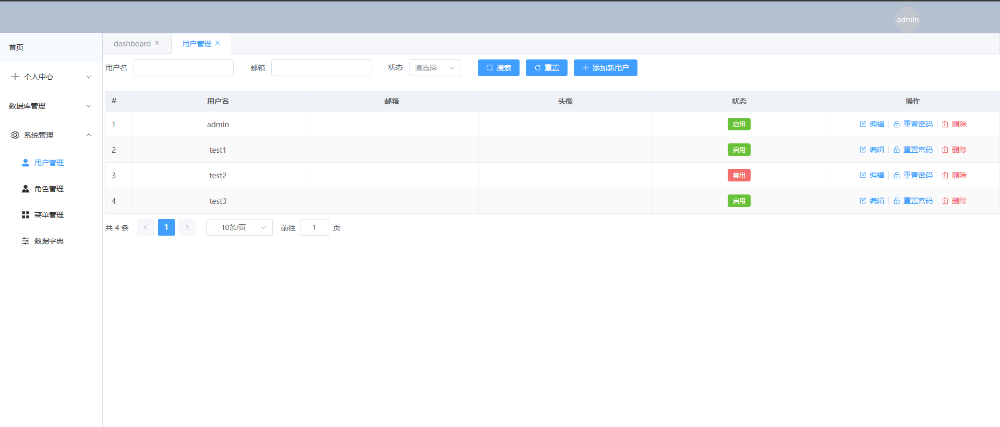

# Fastapi Admin

前后端分离项目实现的一个后端管理框架

- 前端：vue3 + element plus
- 后端：fastapi + sqlmodel
- 任务管理: rpyc+apscheduler

**个人学习项目，只会对明显的 bug 进行修复，不会进行过多新功能的更新**

常用分支说明：

- main：主分支，所有功能都会往这里合并
- test： 测试分支

## 环境配置说明

项目根目录提供了 `.env.example` 文件作为环境变量的模板。

1. **开发环境**：
   复制 `.env.example` 为 `.env.dev`，根据需要修改变量（通常默认值即可用于本地开发）。

   ```bash
   cp .env.example .env.dev
   ```

2. **生产环境**：
   复制 `.env.example` 为 `.env.prod`，并修改相关配置（如 `NODE_ENV`, `SECRET_KEY`, 数据库密码等）。
   ```bash
   cp .env.example .env.prod
   ```

**注意**：`.env` 和 `.env.*` (除了 `.env.example`) 已被加入 `.gitignore`，请勿提交包含敏感信息的配置文件。

开发环境使用
docker compose --env-file .env.dev up -d

构建生产镜像

- 修改.env.prod 中打包镜像版本信息

  ```
  BACKEND_IMAGE=fastapi-admin/backend-prod:2.1.0
  FRONTEND_IMAGE=fastapi-admin/frontend-prod:2.1.0
  ```

- 打包生成生产镜像

  ```
  docker compose -f docker-compose-build.yml --env-file .env.prod build --no-cache
  ```

- 手动导出与导入镜像
  ```
  #导出镜像
  docker save -o <输出文件名.tar> <镜像名:标签>
  #导入镜像
  docker load -i <镜像文件.tar>
  ```

## 测试环境服务启动

1. nginx 添加配置：

```
参考项目目录下的 `nginx/dev.conf` 文件。
```

## 生产环境部署

1. 前端执行打包命令

```

npm run build

```

2. 添加 nginx 配置

```
参考项目目录下的 `nginx/prod.conf` 文件。
```

## 服务管理

- dev:开发环境，使用 uvicorn 启动
- pro:生产环境，使用 gunicorn 启动

```

./service.sh {dev|pro} {start|stop|restart}

```

后端需要修改对应配置文件信息

- dev: config/development.yaml
- pro: config/production.yaml

开发模式下，uvicorn 服务能自动刷新，rpyc 服务无法自动刷新，需要手动重启

## 数据库迁移管理（Alembic）

项目使用 Alembic 进行数据库版本管理和迁移，支持容器化环境。

### 容器化环境操作

#### 服务运行时操作（推荐）

当 Docker Compose 服务已启动时，使用 `exec` 命令：

```bash
# 查看当前迁移状态
docker-compose --env-file .env.dev exec backend_api alembic current

# 查看迁移历史
docker-compose --env-file .env.dev exec backend_api alembic history

# 生成新的迁移文件（自动检测模型变更）
docker-compose --env-file .env.dev exec backend_api alembic revision --autogenerate -m "迁移描述信息"

# 执行迁移到最新版本
docker-compose --env-file .env.dev exec backend_api alembic upgrade head

# 回滚到指定版本
docker-compose --env-file .env.dev exec backend_api alembic downgrade <revision_id>

# 回滚一个版本
docker-compose --env-file .env.dev exec backend_api alembic downgrade -1
```

#### 服务未启动时操作

当 Docker Compose 服务未启动时，使用 `run` 命令：

```bash
# 生成新的迁移文件（自动检测模型变更）
docker compose -f .\docker-compose.yml --env-file .env.dev run backend_api alembic revision --autogenerate -m "迁移描述信息"

# 执行迁移到最新版本
docker compose -f .\docker-compose.yml --env-file .env.dev run backend_api alembic upgrade head

# 查看当前迁移状态
docker compose -f .\docker-compose.yml --env-file .env.dev run backend_api alembic current

# 查看迁移历史
docker compose -f .\docker-compose.yml --env-file .env.dev run backend_api alembic history
```

**注意：** 使用 `run` 命令时必须指定 `--env-file .env.dev` 参数，否则环境变量无法正确加载。

### 本地开发环境操作

```bash
# 进入后端目录
cd backend/app

# 查看当前迁移状态
alembic current

# 生成新的迁移文件
alembic revision --autogenerate -m "迁移描述信息"

# 执行迁移
alembic upgrade head
```

### 迁移文件管理

- 迁移文件位置：`backend/app/alembic/versions/`
- 配置文件：`backend/app/alembic.ini`（已配置支持容器化环境变量）
- 环境配置：`backend/app/alembic/env.py`

### 注意事项

1. **生产环境迁移前务必备份数据库**
2. 迁移文件生成后，请检查并确认变更内容
3. 团队开发时，及时同步迁移文件
4. 避免手动修改已提交的迁移文件
5. 容器化环境会自动使用环境变量中的数据库配置

## 约束

1. 后端数据库对于布尔值的传递统一数据库设置为 tinyint，0 为假，1 为真
2. 前端所有 bool 都 0 为假，1 为真

# 功能实现介绍

## 分页查询实现

### 前端

```js
<!-- 导入分页相关方法 -->
import usePagination from '@/composables/usePagination'

<!--定义一个搜索字段-->
const searchForm = {
    name: null,
    email: null,
    enable: null
}

<!-- 传入查询相关字段信息 -->
const {
    search,
    tableData,
    currentPage,
    pageSize,
    orderModel,
    total,
    freshCurrentPage,
    handleSearch
} = usePagination('/api/users/search', searchForm)
```

### 后端

定义了一个分页模型

```python
from typing import Optional, Generic, TypeVar
from pydantic import BaseModel

T = TypeVar('T')


class Pagination(BaseModel, Generic[T]):
    search: T
    page: Optional[int] = 1
    page_size: Optional[int] = 10
    model: Optional[str] = 'asc'
```

使用

```python
@router.post('/dict/item/search', summary="字典列表查询", response_model=ApiResponse[SearchResponse[DictRead]])
async def search_items(search: Pagination[DictItemSearch], session: Session = Depends(get_session)):
    # 需要定义一个filter_type，用于区分各个字段的匹配形式，可用为：l_like、r_like、like、eq、ne、lt、le、gt、ge
    filter_type = DictItemSearchFilter(dict_id='eq', label='like', enable='eq', value='like')
    total = crud.internal.dict_item.search_total(session, search.search, filter_type.model_dump())
    items: List[DictRead] = crud.internal.dict_item.search(session, search, filter_type.model_dump())
    # 转义下数据类型，不然在执行return的时候，会去获取外键、关联字段相关的内容，容易造成数据量过多等问题
    item_list = [DictRead.from_orm(item) for item in items]
    return ApiResponse(
        data={
            'total': total,
            'data': item_list
        }

    )
```

## 权限管控

通过 casbin 实现简化的权限管控功能，思路如下：

1. 对于不需要 token 验证的，写入 settings 的 APISettings.NO_VERIFY_URL 中
2. 对于需要权限管控的接口，写入 casbin 中，并且对需要权限验证的接口使用 casbin 验证
3. 前端通过权限字段，进行显示
4. 只能对按钮级别的功能实现权限管控
5. 页面管控，只是后端返回菜单列表，前端根据菜单列表进行显示，后端没有对页面进行权限管控

### 前端

v-permission 定义了权限标识，当拥有权限时，可以页面上能显示按钮，同时，后端也会进行权限的判断。

```js
   <el-button v-permission="'role:update'" v-if="scope.row.name!='admin'" type="primary" size="small"
                     @click = "handleEdit(scope.row)" > 编辑
    </el-button>
```

### 后端

```python
@router.put('/roles', summary="更新角色", response_model=ApiResponse[Role],
            dependencies=[Depends(Authority('role:update'))])
async def update_roles(role_info: RoleUpdate, session: Session = Depends(get_session)):
    print(role_info)
    if role_info.name == 'admin':
        ApiResponse(code=status.HTTP_400_BAD_REQUEST, message='admin权限组无法更新信息')
    db_obj = crud.internal.role.get(session, role_info.id)
    enable_menus = role_info.menus
    delattr(role_info, 'menus')
    db_obj = crud.internal.role.update(session, db_obj, role_info)
    crud.internal.role.update_menus(session, db_obj, enable_menus)
    return ApiResponse(
        data=db_obj
    )
```

## 项目截图

### 系统登录


### 用户管理




### 角色管理


### 菜单管理


### 数据字典管理


### 任务管理


### 参考项目：

- https://github.com/xingxingzaixian/FastAPI-MySQL-Tortoise-Casbin
